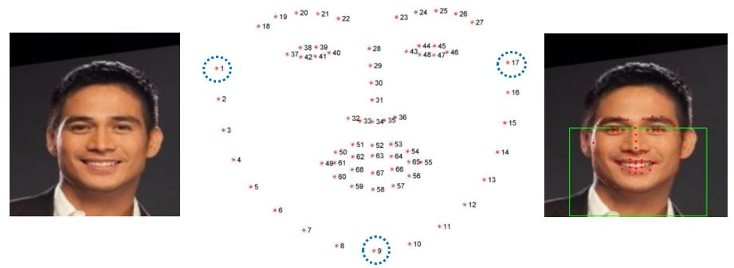

## GAN-based-face-mask-removal
이 프로젝트는 마스크를 쓴 인물의 이미지에서 마스크 뒤에 감춰진 얼굴을 복원하는 프로젝트입니다. U-Net구조를 기반으로 하여 마스크 객체의 값을 1로 나머지 부분을 0으로 [Segmentation](https://arxiv.org/abs/1505.04597)하여 마스크를 쓴 인물의 사진에서 마스크에 해당하는 부분에 Random Noise를 합성한 뒤, [GAN](https://arxiv.org/abs/1406.2661)구조를 사용해 Random Noise부분을 실제 얼굴로 복원합니다.

## Environment
- python==3.8
- tensorflow-gpu==2.4.0
- opencv-python==4.5.5.62
- dlib==19.18
- numpy==1.22.0
- matplotlib==3.5.1

## DataSet
학습에 사용된 이미지는 약 30,000장 정도 사용되었습니다.
- CelebA dataset: http://mmlab.ie.cuhk.edu.hk/projects/CelebA.html

## Data Preprocessing
학습에 적합한 데이터를 사용하기 위해서 CelebA원본 Data에 마스크 이미지를 합성해줍니다.

- opencv, dlib을 사용한 Face landmark 찾기  

  Face Landmark는 얼굴의 특징점을 말합니다. 예를 들어 동공의 위치, 입술의 좌표, 눈썹의 좌표 등 이런 값들을 추출하여 x, y 값으로 리턴을 하는데 대표적으로 Python의 라이브러리 중 dlib, opencv로 랜드마크를 추출합니다.  
[Face Landmark Reference](https://www.pyimagesearch.com/2017/04/03/facial-landmarks-dlib-opencv-python/)
<!-- -->


- 특징점을 기준으로 마스크 합성
  

## Model Architecture
<p align="center">

</p>

- Training Details  

  Segmentation을 위한 Mask G를 먼저 학습합니다. 그 후 Face G의 학습을 위해 각 batch마다 학습된 Mask G의 결과로 얻은 마스크 검출영역인 binary image를 이용해 해당 부분에 random noise를
합성한 후 합성된 이미지를 Face G의 입력으로 합니다.
  - Batch size:4
  - Training epoch:10
  - Adam optimizer
  - Learning rate:0.0002
  - Leaky ReLU:0.2
  - Dropout:0.5
  - Instance Normalization

## How to Run

- Mask G Training
 ```
 python src/main.py --mode mask-train
 ```
- Face G Training,  Face D Training
 ```
 python src/main.py --mode face-train
 ```
- Test
 ```
 python src/main.py --mode multi_test --dir_test ./test
 ```
 
## Result

- epoch의 변화에 따른 출력 결과
<p align="center">

</p>  

- 학습을 끝낸 후 출력 결과
<p align="center">

</p>  

## Reference
- NIZAM UD DIN, KAMRAN JAVED , SEHO BAE, AND JUNEHO YI "A Novel GAN-Based Network for Unmasking of Masked Face"  
  (pull paper : https://ieeexplore.ieee.org/document/9019697)
- Instance Normalization code : https://github.com/bigbreadguy/Batch_Instance_Normalization-Tensorflow2.0
- python opencv, dlib face landmark https://www.pyimagesearch.com/2017/04/03/facial-landmarks-dlib-opencv-python

